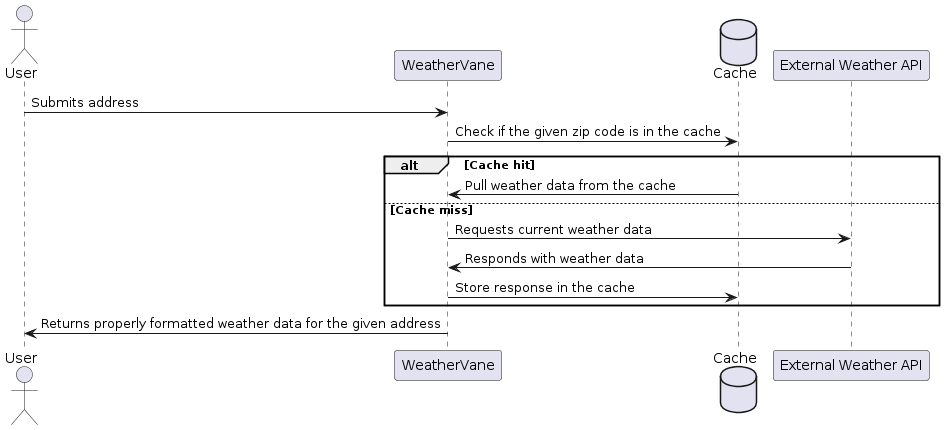

# README

WeatherVane is a demo weather app.

## Requirements

- Ruby 3.3.1
- `bundler`
- `git`

Also recommended:
- `rbenv`
- [ADR tools](https://github.com/npryce/adr-tools)
- A tool for working with [PlantUML](https://plantuml.com/)
- imagination :)

## Installation

1. After cloning the repo, navigate to the root and `bundle install` to install gem dependencies.
2. Once that completes, set up the database by running `bundle exec rails db:setup`.

You should be good to go!  Run the app with `bundle exec rails s`.

## Testing

Run tests with `bundle exec rspec`.

## Linting

Before merging to main, please make sure to run the linter and fix any violations: `bundle exec rubocop`

## Architecture

Architecture Decision Records (ADRs) and diagrams can be found in the architecture directory.

### Sequence Diagram

